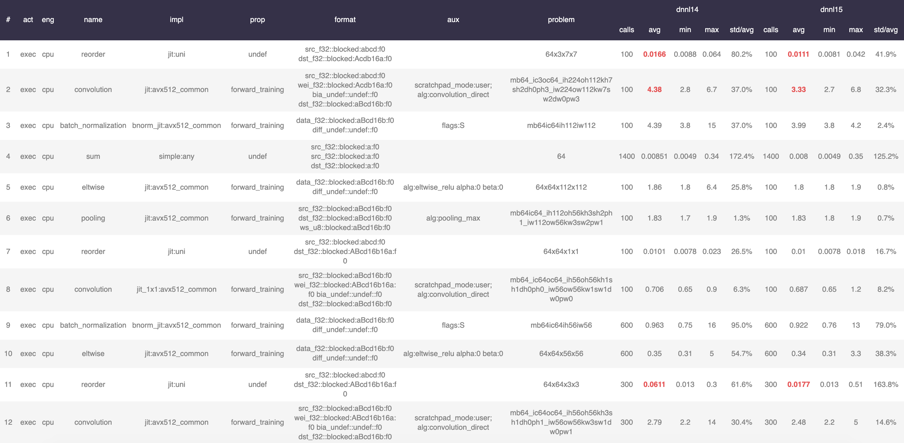

# OneDNN Verbose Toolkit

## What's Inside

- summary.py

- compare.py

- stat.py


## Workflow

Suppose you were noticing a performance gap between different DNNL releases. You first dumped the verbose output into two files called `new.log` and `old.log` by enabling `MKLDNN_VERBOSE=1`.

Then you are supposed to use `summary.py` to get a big picture of overall performance.

```
python summary.py -f new:/path/to/new.log -f old:/path/to/old.log
```

```
--- -------- ------- ------------  ---------------------------------------------
Op  Name      #Calls    Time (ms)
--- -------- ------- ------------  ---------------------------------------------
batch_normalization
  backward
    new         3224     7025.888  ░░░░░░░
    old         3224     7256.143  ░░░░░░░
  forward_training
    new         3224    11607.576  ░░░░░░░░░░░░
    old         3224     8574.092  ░░░░░░░░░

convolution
  backward_data
    new         3193    11631.982  ░░░░░░░░░░░░
    old         3193    15745.028  ░░░░░░░░░░░░░░░░
  backward_weights
    new         3224    47207.614  ░░░░░░░░░░░░░░░░░░░░░░░░░░░░░░░░░░░░░░░░░░░░░
    old         3224    38243.037  ░░░░░░░░░░░░░░░░░░░░░░░░░░░░░░░░░░░░░
  forward_training
    new         3224    12192.521  ░░░░░░░░░░░░
    old         3224    15969.655  ░░░░░░░░░░░░░░░░

eltwise
  backward_data
    new         3100     5519.782  ░░░░░░
    old         3100     5229.421  ░░░░░
  forward_training
    new         3100     2106.230  ░░░
    old         3100     2307.821  ░░░

inner_product
  backward_data
    new           31       21.379  ░
    old           31       17.760  ░
  backward_weights
    new           31       10.349  ░
    old           31        9.122  ░
  forward_training
    new           31       20.057  ░
    old           31       14.547  ░

pooling
  backward_data
    new           62      157.413  ░
    old           62      149.904  ░
  forward_training
    new           62      128.466  ░
    old           62      197.110  ░

reorder
  forward
    new        19716     6713.656  ░░░░░░░
    old        18569     5765.998  ░░░░░░

sum
  forward
    new         8494     5005.062  ░░░░░
    old         8494     5150.605  ░░░░░
```

In the example above, you would notice there is a huge gap in `backward_weights` of `convolution`, then you could inspect it separately with `compare.py` to filter out those kernels that's 2x slower (by setting `--thresh=2`).

```
python compare.py -f new:/path/to/new.log -f old:/path/to/old.log \
  --thresh 2 --show worse --op convolution --prop-kind backward_weights
```

```
1
dnnl_verbose,exec,cpu,convolution,gemm:jit,backward_weights,src_bf16::blocked:abcd:f0 wei_f32::blocked:abcde:f0 bia_undef::undef::f0 dst_bf16::blocked:abcd:f0,,alg:convolution_direct,mb128_g32ic256oc256_ih28oh28kh3sh1dh0ph1_iw28ow28kw3sw1dw0pw1,42.1951
mkldnn_verbose,exec,convolution,gemm:jit,backward_weights,fsrc:nchw fwei:goihw fbia:undef fdst:nchw,alg:convolution_direct,mb128_g32ic256oc256_ih28oh28kh3sh1dh0ph1_iw28ow28kw3sw1dw0pw1,13.3188
3.17

2
dnnl_verbose,exec,cpu,convolution,gemm:jit,backward_weights,src_bf16::blocked:abcd:f0 wei_f32::blocked:abcde:f0 bia_undef::undef::f0 dst_bf16::blocked:abcd:f0,,alg:convolution_direct,mb128_g32ic256oc256_ih28oh28kh3sh1dh0ph1_iw28ow28kw3sw1dw0pw1,42.2771
mkldnn_verbose,exec,convolution,gemm:jit,backward_weights,fsrc:nchw fwei:goihw fbia:undef fdst:nchw,alg:convolution_direct,mb128_g32ic256oc256_ih28oh28kh3sh1dh0ph1_iw28ow28kw3sw1dw0pw1,13.3499
3.17

......

186
dnnl_verbose,exec,cpu,convolution,gemm:jit,backward_weights,src_bf16::blocked:abcd:f0 wei_f32::blocked:abcde:f0 bia_undef::undef::f0 dst_bf16::blocked:abcd:f0,,alg:convolution_direct,mb128_g32ic128oc128_ih56oh56kh3sh1dh0ph1_iw56ow56kw3sw1dw0pw1,61.0959
mkldnn_verbose,exec,convolution,gemm:jit,backward_weights,fsrc:nchw fwei:goihw fbia:undef fdst:nchw,alg:convolution_direct,mb128_g32ic128oc128_ih56oh56kh3sh1dh0ph1_iw56ow56kw3sw1dw0pw1,24.2
2.52


much better:     50
0. dnnl_verbose,exec,cpu,convolution,gemm:jit,backward_weights,src_bf16::blocked:abcd:f0 wei_f32::blocked:abcde:f0 bia_undef::undef::f0 dst_bf16::blocked:abcd:f0,,alg:convolution_direct,mb128_g32ic1024oc1024_ih14oh7kh3sh2dh0ph1_iw14ow7kw3sw2dw0pw1
1. dnnl_verbose,exec,cpu,convolution,jit_bf16:avx512_core_bf16,backward_weights,src_bf16::blocked:abcd:f0 wei_f32::blocked:Acdb16a:f0 bia_undef::undef::f0 dst_bf16::blocked:aBcd16b:f0,,alg:convolution_direct,mb128_ic3oc64_ih224oh112kh7sh2dh0ph3_iw224ow112kw7sw2dw0pw3

much worse:      186
0. dnnl_verbose,exec,cpu,convolution,gemm:jit,backward_weights,src_bf16::blocked:abcd:f0 wei_f32::blocked:abcde:f0 bia_undef::undef::f0 dst_bf16::blocked:abcd:f0,,alg:convolution_direct,mb128_g32ic256oc256_ih28oh28kh3sh1dh0ph1_iw28ow28kw3sw1dw0pw1
1. dnnl_verbose,exec,cpu,convolution,gemm:jit,backward_weights,src_bf16::blocked:abcd:f0 wei_f32::blocked:abcde:f0 bia_undef::undef::f0 dst_bf16::blocked:abcd:f0,,alg:convolution_direct,mb128_g32ic128oc128_ih56oh56kh3sh1dh0ph1_iw56ow56kw3sw1dw0pw1

almost the same: 2988
```

Verbose log is only an indicator for you to debug performance issues. If the gap can also be reproduced in benchdnn, then you should report it to the OneDNN team.


## Other Usages

### One-shot summary from pipe

```
MKLDNN_VERBOSE=1 python -u foo.py | python summary.py
```

### Trimming

If you are going to trim lines at the beginning of verbose output, say you don't want to take the warm-up iterations into account, you could first add a clear mark in the test script as a delimiter.

```python
# in test.py
for _ in range(10):
  run()
print('### END UP WARMUP ###')
for _ in range(5000):
  run()
```

Make sure you are enabling unbuffered output flag `-u` for python.

```
MKLDNN_VERBOSE=1 python -u test.py | python summary.py --delimiter '### END UP WARMUP ###'
```

## Advanced Analysis

We also provide a tool called `stat.py` for advanced analysis. The usage is the same as `summary.py`.

It groups the primitives in order of appearance, and computes avg/min/max of them as well as their relative standard deviation (std / mean).

```
python stat.py -f dnnl1.4:/path/to/test_14.log -f dnnl1.5:/path/to/test_15.log
```


